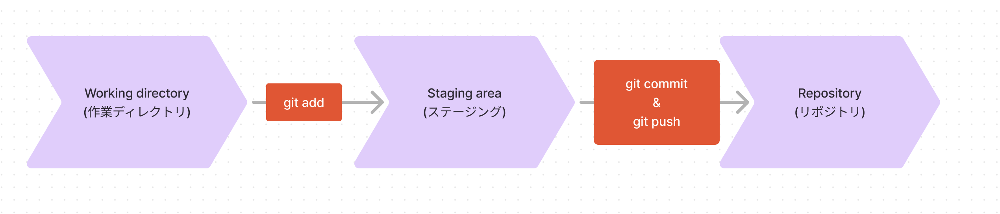

# コミットとプッシュ

コミットとプッシュとは、Git での作業の中で最も基本的な操作です。

## コミット

Git ではファイルの変更をある地点で記録することができます. これを **コミット** `commit` と言います.

コミットをすることで, その時点でのファイルの状態を記録することができます. また, どのファイルがどのように変更されたのかも記録されます. またコミットを取り消すことで, 変更前のファイルに戻すこともできます.

コミットは以下のコマンドで行うことができます.

```sh
git commit -m "バグを修正しました"
```

[コミットするにはファイルを選択する必要があります](#ステージング).

### ステージング

ファイルの変更をコミットする前に Git では記録するファイルを選択する必要があります. これを **ステージング** `staging` と言います.

ステージングは以下のコマンドで行うことができます.

```sh
# git add <ファイル名>
git add Main.java
```

コミットする際はこのステージングに上がっているファイルが選ばれます. 従ってステージングを行っていないファイルはコミットされません.

## プッシュ

ステージングし, コミットした一個一個の変更をリモートリポジトリに送ることを **プッシュ** `push` と言います.

プッシュは以下のコマンドで行うことができます.

```sh
git push
```

----

ステージング, コミット, プッシュは Git の基本的操作です. とても大事な操作なので, しっかりと覚えておきましょう.


